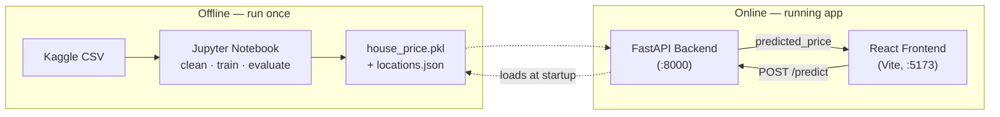
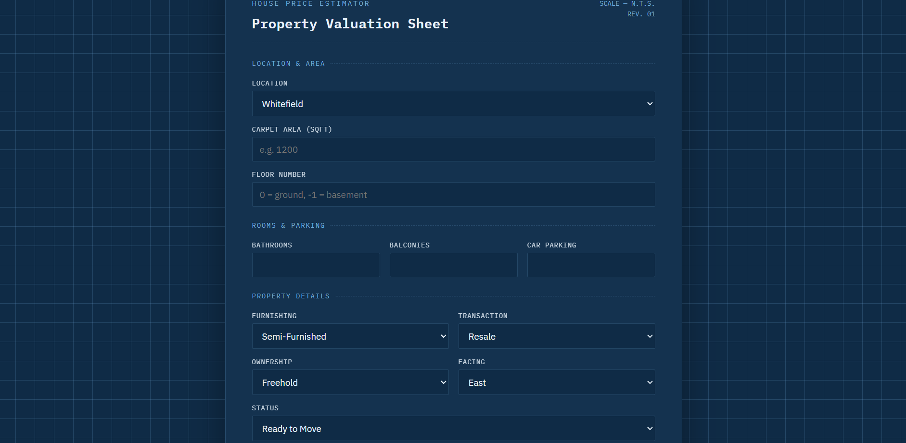
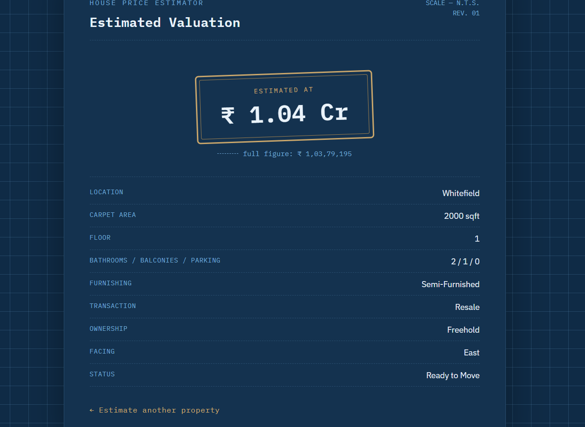

# House Price Prediction — End-to-End ML Web App

Predicts Indian residential property prices from a Kaggle listings dataset. Raw,
messy real-estate data goes in one end; a trained regression model, a FastAPI
backend, and a React frontend come out the other.

> Dataset: [House Price by Juhi Bhojani](https://www.kaggle.com/datasets/juhibhojani/house-price) (Kaggle)

## Overview

1. **`notebooks/`** — cleans the raw CSV, engineers features, trains and compares
   multiple regression models, and exports the winner as a single scikit-learn
   `Pipeline` (`house_price.pkl`).
2. **`backend/`** — a FastAPI service that loads that pipeline once at startup and
   serves predictions over `POST /predict`.
3. **`frontend/`** — a React + TypeScript + Vite app where a user fills in property
   details and sees the predicted price.

## Architecture



## Tech stack

| Layer      | Technology                                                        |
| ---------- | ------------------------------------------------------------------ |
| Modeling   | Python, pandas, scikit-learn (`Pipeline` + `ColumnTransformer`)     |
| Backend    | FastAPI, Pydantic v2, pydantic-settings, uvicorn, joblib            |
| Frontend   | React 18, TypeScript, Vite, React Router                           |
| Testing    | pytest, FastAPI `TestClient`                                       |
| Packaging  | Docker (backend)                                                   |

## Project structure

```
house-price-project/
├── notebooks/
│   └── house_price_model.ipynb   # data cleaning, EDA, training, export
├── backend/
│   ├── app/
│   │   ├── main.py                    # FastAPI app, CORS, startup model loading
│   │   ├── api/routes/prediction.py   # GET /health, POST /predict
│   │   ├── core/config.py             # settings from .env (pydantic-settings)
│   │   ├── schemas/prediction.py      # PredictionRequest / PredictionResponse
│   │   ├── services/
│   │   │   ├── preprocessing.py       # request -> one-row DataFrame
│   │   │   └── inference.py           # loads .pkl, runs predict()
│   │   └── utils/logging_config.py
│   ├── models/                        # house_price.pkl + locations.json go here
│   ├── tests/test_prediction.py
│   ├── requirements.txt
│   ├── .env.example
│   └── Dockerfile
├── frontend/
│   └── src/
│       ├── api/predictionClient.ts    # fetch wrapper
│       ├── components/PredictionForm.tsx
│       ├── pages/HomePage.tsx | ResultPage.tsx | NotFoundPage.tsx
│       ├── types/prediction.ts        # mirrors the backend schema
│       └── App.tsx                    # routes: / , /result , * (404)
├── .gitignore
└── README.md
```

## 1. Get the dataset

Download **House Price** by Juhi Bhojani from Kaggle:
https://www.kaggle.com/datasets/juhibhojani/house-price

**Option A — manual:** click *Download*, unzip, and place `house_prices.csv` in
`notebooks/data/`.

**Option B — Kaggle CLI:**

```bash
pip install kaggle
# Get an API token: Kaggle → Settings → API → "Create New Token"
# Place kaggle.json in ~/.kaggle/ (macOS/Linux) or C:\Users\<you>\.kaggle\ (Windows)
kaggle datasets download -d juhibhojani/house-price -p notebooks/data --unzip
```

## 2. Train the model

```bash
cd notebooks
python -m venv .venv && source .venv/bin/activate   # .venv\Scripts\activate on Windows
pip install jupyter pandas numpy scikit-learn matplotlib seaborn joblib
jupyter notebook house_price_model.ipynb
```

Run all cells top to bottom. This produces `house_price.pkl` and `locations.json`
inside `notebooks/`. Copy both into the backend and frontend:

```bash
cp house_price.pkl ../backend/models/house_price.pkl
cp locations.json ../backend/models/locations.json
cp locations.json ../frontend/src/data/locations.json
```

> **Version pinning:** the notebook's export cell prints your installed
> `scikit-learn` version. Pin that exact version in `backend/requirements.txt` —
> a pickle made with one scikit-learn version does not reliably load with another.

## 3. Run the backend

```bash
cd backend
python -m venv .venv && source .venv/bin/activate
pip install -r requirements.txt
cp .env.example .env
uvicorn app.main:app --reload
```

Open http://localhost:8000/docs to try `/predict` from the Swagger UI.

**Environment variables** (`backend/.env`):

| Variable        | Default                     | Description                                  |
| --------------- | ---------------------------- | --------------------------------------------- |
| `APP_NAME`      | `House Price Prediction API` | Shown in the OpenAPI docs                     |
| `MODEL_PATH`    | `models/house_price.pkl`     | Path to the exported pipeline, relative to `backend/` |
| `LOCATIONS_PATH`| `models/locations.json`      | Path to the allowed-locations list             |
| `CORS_ORIGINS`  | `http://localhost:5173`      | Comma-separated list of allowed frontend origins |
| `LOG_LEVEL`     | `INFO`                       | Python logging level                           |

Run the backend tests:

```bash
pytest
```

## 4. Run the frontend

```bash
cd frontend
npm install
cp .env.example .env
npm run dev
```

Open http://localhost:5173, fill in the form, and submit to see a live prediction.

**Environment variables** (`frontend/.env`):

| Variable              | Default                 | Description                  |
| ---------------------- | ------------------------ | ----------------------------- |
| `VITE_API_BASE_URL`    | `http://localhost:8000` | Base URL of the FastAPI backend |

## API reference

### `GET /health`

```bash
curl http://localhost:8000/health
```

```json
{ "status": "ok", "model_loaded": true }
```

### `POST /predict`

```bash
curl -X POST http://localhost:8000/predict \
  -H "Content-Type: application/json" \
  -d '{
    "location": "Whitefield",
    "carpet_area_sqft": 1200,
    "floor_num": 3,
    "bathroom": 2,
    "balcony": 1,
    "car_parking": 1,
    "furnishing": "Semi-Furnished",
    "transaction": "Resale",
    "ownership": "Freehold",
    "facing": "East",
    "status": "Ready to Move"
  }'
```

```json
{ "predicted_price": 7845213.42 }
```

A request with invalid data (e.g. `"carpet_area_sqft": -50`) returns `422` with a
list of validation errors.

## Model metrics

Fill this in from your notebook's Section 5 (Evaluate) once you've run it against
the real dataset:

| Model              | Target        | MAE (₹) | RMSE (₹) | R²   |
| ------------------- | -------------- | -------- | --------- | ----- |
| LinearRegression    | raw            | _fill in_ | _fill in_ | _fill in_ |
| RandomForest        | `log1p(price)` | _fill in_ | _fill in_ | _fill in_ |
| GradientBoosting    | `log1p(price)` | _fill in_ | _fill in_ | _fill in_ |

**Winner:** _name the model you selected and, in 1–2 sentences, why (lowest RMSE /
best R² / best generalization on cross-validation)._

## Screenshots

_Add screenshots of the running form and result page here, e.g.:_

```


```

## Troubleshooting

**`Application startup failed. Exiting.` when running `uvicorn app.main:app --reload`**

Almost always one of two causes:

1. **A custom Python class was pickled into `house_price.pkl`.** `joblib`/`pickle` only
   stores a *reference* to a class, not its code. If you (or an earlier version of this
   project) wrapped the final model in a class defined inside the notebook, the backend
   process has no way to resolve that class when unpickling, and `joblib.load()` raises
   an `AttributeError` during FastAPI's startup lifespan — which kills the whole app. The
   current notebook avoids this by using scikit-learn's built-in `TransformedTargetRegressor`
   for the log-price transform instead of a hand-rolled wrapper class, so the exported
   pipeline is 100% standard scikit-learn objects. If you're hitting this, re-run
   Section 4 onward in the notebook to regenerate `house_price.pkl`, then re-copy it into
   `backend/models/`.
2. **A scikit-learn version mismatch.** The notebook's export cell prints the exact
   `scikit-learn` version it trained with — make sure `backend/requirements.txt` pins that
   same version before `pip install`-ing.

If neither applies, run `uvicorn app.main:app --reload` (without a background process) and
read the full traceback printed just above "Application startup failed" — it names the
exact exception.

## License

For educational use as part of a student project assignment.
